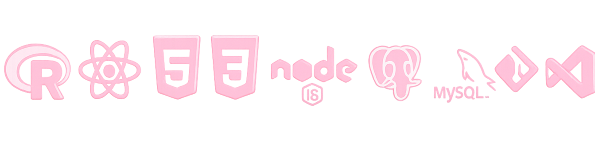

  

  

  

<h3>𝓢he / her</h3>

Currently learning <b>Advanced Machine Learning & AI</b> 
Building Full Stack Applications with React, Node.js & PostgreSQL 
Interested in Machine Learning, Data Analytics & Web Development

𝙈𝓪𝓲l at “ <a href="mailto:mayahkamat@gmail.com" style="color:pink;">
  mayahkamat@gmail.com
</a>

𝙏𝓮chS𝓽ack  :

  

  

   
𝓟rojects ’

i)<a href="https://live-weather-dashboard-fgg8.onrender.com/" target="_blank">𝓵iv𝓮 weather dashboard</a>
ii) 

